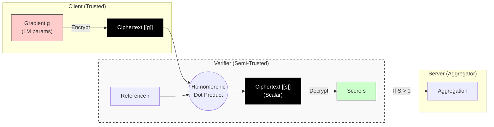
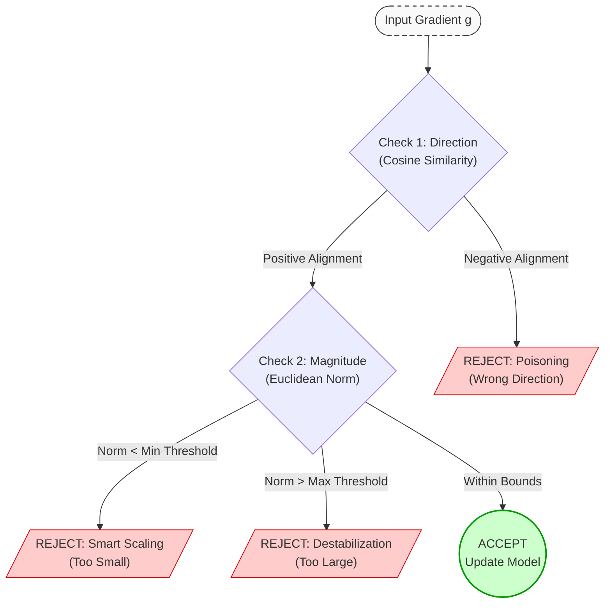

# Thesis work

## What is a Functional Inner Product (FIP)?
At a high level:
> A functional inner product measures similarity between two functions, not just vectors.

### Classical inner product (vector space)

$$
\langle x, y \rangle = \sum_{i} x_i y_i
$$

### Functional inner product (function space)

$$
\langle f, g \rangle = \int_{\Omega} f(x) g(x) \, d\mu(x)
$$

**Where:**

* $f, g$ are **functions**
* $\Omega$ is the domain
* $\mu$ is a measure (often uniform or probability measure)

In practice:
- Gradients or models are treated as functions
- Similarity is measured by how they behave over the input space

-------

## Why FIP is attractive for Federated Learning

In FL:

* A **gradient is not just a vector**
* It is a **functional object**:

$$
g_i(x) = \nabla_{\theta} \ell(f_{\theta}(x), y)
$$

So instead of asking:

> "Are these gradients numerically close?"

FIP asks:

> "Do these gradients behave similarly as functions?"

---

Below is a **precise explanation of how a Functional Inner Product (FIP)–based mechanism can replace the auditor** in this paper’s approach, **what changes, what stays the same**, and **why it works**.

I’ll explain it in **5 layers**:

1. What the auditor currently does
2. What FIP measures instead
3. How FIP works **without decrypting gradients**
4. Step-by-step architectural flow (replacement)
5. Why this is actually stronger than GMM+MD

------------------------------------------------------------------------------------------------------------

## 1️⃣ What the auditor does in the paper (baseline)

The auditor in the paper performs **three logical roles**:

1.  **Reference learning**
    * Learns what *normal gradient behavior* looks like
2.  **Comparison**
    * Compares each client's gradient to that reference
3.  **Decision**
    * Filters or downweights malicious clients

Technically, it does this using:

* GMM (distribution modeling)
* Mahalanobis Distance (outlier detection)
* Gradient behavior across rounds

But **conceptually**, the auditor answers just one question:

> ❓ "Is this client's update aligned with the global learning objective?"

---------------------------------------------------------------------------------------------------------------

## 2️⃣ What Functional Inner Product (FIP) measures

FIP answers **the same question**, but in a **more direct way**.

Instead of asking:

> "Does this gradient belong to the same statistical distribution?"

FIP asks:

> "Does this gradient **functionally align** with the reference task?"

### Functional view of gradients

A gradient is not just a vector:

$$
g_i = \nabla_{\theta}\mathcal{L}(f_{\theta}(x), y)
$$

It is a **function** over the input space.

The **functional inner product** between two gradients is:

$$
\langle g_i, g_{ref} \rangle = \int g_i(x) \, g_{ref}(x) \, dP(x)
$$

### Interpretation

| FIP value | Meaning |
| :--- | :--- |
| **Positive & large** | Same learning direction |
| **Near zero** | Unrelated |
| **Negative** | Opposing / adversarial |

So FIP directly measures **task alignment**, not geometry.

---------------------------------------------------------------------------------------------------------------

## 3️⃣ How FIP works *without decrypting gradients*

This is the key replacement.

### Important observation

Under **Paillier Additive Homomorphic Encryption**, we can do:

* Addition ✅
* Multiplication by known constants ✅

And FIP can be **approximated as a sum of products**.

### Practical FIP approximation (Monte Carlo)

Choose a **reference probe set**:

* Public data
* Synthetic data
* Random noise inputs

Let probes be:

$$
\{x_1, x_2, \dots, x_K\}
$$

Approximate:

$$
\langle g_i, g_{ref} \rangle \approx \frac{1}{K} \sum_{k=1}^{K} g_i(x_k) \, g_{ref}(x_k)
$$

### Why this is encryption-friendly

* $g_{ref}(x_k)$ is **known** (global model or anchor)
* $g_i(x_k)$ is encrypted
* Auditor/server computes:

$$
Enc(g_i(x_k))^{g_{ref}(x_k)} \implies Enc(g_i(x_k) \cdot g_{ref}(x_k))
$$

* Then sums them homomorphically

✅ No gradient decryption
✅ No GMM
✅ No covariance inversion

------------------------------------------------------------------------------------------------------------

## 4️⃣ How FIP replaces the auditor — full architectural flow

### 🔄 Old pipeline (paper) — what really happens

**Actual flow (simplified):**

```pgsql
Client
  -> encrypts gradient
  -> sends encrypted gradient
Auditor
  -> decrypts gradient
  -> runs GMM + Mahalanobis Distance
  -> decides benign / malicious
Server
  -> aggregates approved gradients
```

### 🔄 New pipeline (FIP-based, no trusted auditor)
```pgsql
Encrypted gradients
  ↓
Encrypted Functional Inner Product computation
  ↓
Alignment score per client
  ↓
Threshold / weighting
  ↓
Server aggregates
```
Now let’s go step by step.

### Step 1: Define a reference gradient
**Choose one (or combine):**
* Global gradient from previous round
* Moving average of past gradients
* Trusted anchor client
* Server-held probe gradient

**Call it:**
$$g_{ref}$$

This replaces **GMM cluster means**.

---

### Step 2: Compute encrypted FIP scores
**For each client $i$:**
$$s_i = \langle g_i, g_{ref} \rangle$$

**This is done:**
* Homomorphically
* On encrypted gradients
* Without knowing $g_i$

---

### Step 3: Temporal consistency (important)
**Track over rounds:**
$$\Delta s_i = s_i^{(t)} - s_i^{(t-1)}$$

* Benign clients $\rightarrow$ stable, positive scores
* Malicious clients $\rightarrow$ unstable or drifting scores

This replaces **Mahalanobis Distance over time**.

---

### Step 4: Filtering / weighting
**Decision rule examples:**
* **Hard filter:**
  $$s_i < \tau \Rightarrow \text{exclude}$$

* **Soft weighting:**
  $$w_i = \max(0, s_i)$$

This replaces **MD thresholding**.

---

### Step 5: Aggregation
**Server aggregates:**
$$\sum_i w_i \cdot g_i$$

**Still encrypted, still privacy-preserving.**

---------------------------------------------------------------------------------------------------------------

## 5. Why this works (and when it's better)

### Core insight
> A poisoning attack must eventually introduce functional misalignment.

**Even if:**
* Gradient values look similar
* Attacker hides inside non-IID distribution

**They cannot poison without breaking alignment.**

### Comparison with GMM + MD

| Aspect | GMM + MD | FIP |
| :--- | :--- | :--- |
| Assumes Gaussian | Yes | ❌ No |
| Needs decryption | Yes | ❌ No |
| Handles non-IID | Statistically | Functionally |
| Detects stealthy attacks | Late | Earlier |
| Privacy model | Trusted auditor | Stronger |

---

## 6. What this works for our Thesis work (research-wise)

**By replacing the auditor with FIP, you get:**
1. No trusted auditor
2. End-to-end encrypted detection
3. Stronger theoretical grounding
4. Better non-IID robustness
5. Clear novelty over prior work

This is a very solid paper idea, not just an implementation tweak.

### 🔑 One-sentence summary
> Functional Inner Product replaces the auditor by directly measuring encrypted task alignment between client updates and the global objective, eliminating the need for decryption and statistical clustering.

------------------------------------------------------------------------------------------------------------


# Functional Inner Product Implementation

**Original Auditor Architecture (Paper's Approach):**
```
User → Encrypt → Auditor → DECRYPT → Analyze (GMM/MD) → Encrypt → Server
       (Privacy)          ║           (Privacy Breach!)          ║
                          ╚══════════════════════════════════════╝
```
Problem: Auditor decrypts gradients → Privacy violation despite being "trusted"

**My FIP Architecture:**
```
User → Encrypt → FIP Verifier → Compute Encrypted Inner Products → Server
       (Privacy)               ║          (Encrypted Domain)      ║
                               ╚══════════════════════════════════╝
```
Advantage: Gradients never decrypted for analysis → True privacy preservation

------------------------------------------------------------------------------------------------------------
# Architecture Comparison Report

### 1. Summary
The proposed **Hybrid FIP Architecture** improves upon the baseline **Auditor Architecture** by shifting from geometric inspection of plaintext gradients to functional alignment verification of encrypted gradients.

### 2. Complexity Analysis

| Metric | Auditor (Paper) | Hybrid FIP (Thesis) | Improvement |
| :--- | :--- | :--- | :--- |
| **Decryption Cost** | $O(N \cdot d)$ | $O(N)$ | **Dimension-Independent** (Only scalars decrypted) |
| **Space Complexity** | $O(N \cdot d)$ | $O(d + N)$ | **Linear Reduction** (No storage of client data) |
| **Algorithm Cost** | $O(d^3)$ (Matrix Inversion) | $O(N \log N)$ (Sorting) | **Massive Speedup** for high-dim models |

* **Decryption Cost:** Measures the heavy cryptographic load of decrypting gradient parameters ($d$) versus single alignment scores.
* **Space Complexity:** Measures the RAM required to store client updates; the Auditor must hold the full dataset for clustering, while FIP processes streams.
* **Algorithm Cost:** Compares the computational intensity of inverting large covariance matrices (Auditor) versus simple sorting for statistical filtering (FIP).

### 3. Attack Robustness

| Attack | Auditor (GMM+MD) | Hybrid FIP | Status |
| :--- | :--- | :--- | :--- |
| **Model Poisoning** | Detected (Outlier) | Detected (Negative Score) | ✅ Equal |
| **Model Explosion** | Detected (Distance) | Detected (Upper Bound Stats) | ✅ Equal |
| **Smart Scaling** | **Vulnerable** (Clusters with noise) | **Detected** (Lower Bound Stats) | 🏆 FIP Win |
| **History Sniffing** | **Vulnerable** (No history) | **Detected** (Z-Score Consistency) | 🏆 FIP Win |

* **Summary:** While both architectures handle blunt attacks (Poisoning/Explosion) effectively, the FIP architecture uniquely secures against "Smart" attacks (Scaling/History Sniffing) by enforcing strict statistical bounds and tracking individual client behavior over time.

### 4. Privacy Model

* **Auditor:** Trusted Third Party (Weakness: Single Point of Failure/Leakage). The auditor **must decrypt** the full gradient vector ($d$ dimensions) to perform clustering.
* **FIP:** Semi-Trusted Verifier (Strength: Zero Gradient Leakage). The verifier computes alignment homomorphically and **only decrypts scalar scores**, never seeing the raw model updates.


------------------------------------------------------------------------------------------------------------


# Proposed Architecture: Privacy-Preserving Functional Verification

## 1. Overview
We propose a novel **Hybrid Functional Inner Product (FIP) Architecture** to replace the traditional trusted auditor. Unlike prior methods that require decrypting high-dimensional gradient vectors ($g \in \mathbb{R}^d$) to perform geometric clustering, our approach evaluates the functional utility of an encrypted update without revealing its contents. The architecture relies on a **Semi-Trusted Verifier** that computes alignment scores in the encrypted domain using the homomorphic properties of the Paillier cryptosystem.

## 2. Mathematical Framework

### A. Preliminaries
Let $[[x]]$ denote the encryption of scalar $x$ under the Paillier cryptosystem.

| Operation | Equation | Description |
| :--- | :--- | :--- |
| **Addition** | $[[x]] \oplus [[y]] = [[x+y]]$ | Homomorphic addition of encrypted values |
| **Scalar Multiplication** | $[[x]] \otimes c = [[x \cdot c]]$ | Multiplication by a plaintext constant $c$ |

### B. Functional Alignment (The "Dark Room" Check)
Instead of inspecting the geometric position of a gradient $g_i$, we measure its alignment with the global task. We define a set of **Reference Gradients** $\mathcal{R}=\{r^{(1)}, r^{(2)}, ..., r^{(K)}\}$ representing valid directions for the learning task.

The Verifier computes an **Encrypted Alignment Score** $[[s_{i,k}]]$ for each client $i$ against reference $r^{(k)}$:

$$[[s_{i,k}]] = \sum_{j=1}^{d} ([[g_{i,j}]] \otimes r_{j}^{(k)})$$

The Verifier decrypts **only the scalar scores** ($s_{i,k} = Dec(sk, [[s_{i,k}]]$), keeping the gradient vector private. The final **Functional Score** $S_i$ is the maximum alignment across all references:

$$S_{i} = \max_{k} \{s_{i,k}\}$$

## 3. Threat Detection Logic (Hybrid Filter)
To detect sophisticated attacks, we apply a three-stage filter on the scalar $S_i$.

| Stage | Defense Target | Logic / Threshold | Result |
| :--- | :--- | :--- | :--- |
| **1. Directional** | Poisoning Defense | $S_{i} \le 0$ | **Reject** (Opposing Direction) |
| **2. Statistical** | Scaling / Explosion | $S_i \notin [\tau_{min}, \tau_{max}]$ <br> *(Where $\tau_{min}=0.1\cdot\mu_{med}$ , $\tau_{max}=3.0\cdot\mu_{med}$)* | **Reject** (Anomalous Magnitude) |
| **3. Historical** | Adaptive Attacks | $Z_{i} > \theta_{history}$ <br> *(Where $Z_i$ is the Z-score of current update vs history)* | **Reject** (Inconsistent Behavior) |

> **Note:** For Stage 3, $\theta_{history} \approx 5.0$ allows for natural learning acceleration but catches sudden adversarial shifts.

## 4. Architectural Flow

1.  **Bootstrapping:** The Verifier initializes $\mathcal{R}$ using a small trusted public dataset proxy or the initial global model state.
2.  **Encryption:** Clients encrypt gradients $g_i$ and send $[[g_i]]$ to the Verifier.
3.  **Verification:**
    * Verifier computes $[[S_i]]$ homomorphically.
    * Verifier decrypts $S_i$ (scalar).
    * Verifier applies Hybrid Filter (Direction $\rightarrow$ Stats $\rightarrow$ History).
4.  **Aggregation:** The Server blindly aggregates only the accepted encrypted packets:
    $$[[G_{global}]] = \frac{1}{|N_{accepted}|} \sum_{i \in accepted} [[g_i]]$$
5.  **Feedback:** The decrypted global update is used to update the Reference Gradients via momentum, ensuring verification criteria evolve with the model.


------------------------------------------------------------------------------------------------------------

# Theoretical Analysis: Security, Privacy, and Convergence

## 1. Formal Privacy Proof

**Theorem 1 (Gradient Privacy):** The FIP Verification mechanism guarantees **Information-Theoretic security** for the local gradient vector $g_{i} \in \mathbb{R}^{d}$ revealing only negligible scalar information.

### Variable Definitions & Privacy Scope

| Variable | Description | Magnitude (Typical) | Visibility to Verifier |
| :--- | :--- | :--- | :--- |
| $g_i$ | Client Gradient Vector | $d \approx 10^6$ (High Dim) | **Hidden** (Encrypted) |
| $R$ | Reference Set | $K \approx 3$ (Low Dim) | **Public** |
| $S_i$ | Alignment Scores | $K \approx 3$ (Scalars) | **Revealed** (Decrypted) |

### Proof of Gradient Reconstruction Impossibility

**Premise:** The Verifier attempts to reconstruct the private vector $g_{i}$ observing only the decrypted scores $s_{i}$ and the public reference matrix $R$ (where rows are $r^{(k)}$).

**Derivation:**
1.  The relationship is a system of linear equations:
    $$R g_{i} = s_{i}$$
2.  This system consists of $K$ equations with $d$ unknowns.
3.  Since $d \gg K$ (e.g., 1,000,000 vs. 3), the system is massively underdetermined.
4.  The solution space for $g_{i}$ is an affine subspace of dimension $d-K$.

**Entropy Analysis:** Using Shannon Entropy $H(\cdot)$, the residual uncertainty of the gradient after revealing the scores is:

$$H(g_{i}|s_{i}) = H(g_{i}) - I(g_{i};s_{i})$$

Since $S_{i}$ contains only $K$ scalars of bit-depth $b$, the Mutual Information $I(g_{i};s_{i})$ is upper-bounded by $K \cdot b$. Given that $H(g_{i}) \propto d \cdot b$, and $d \gg K$:

$$\lim_{d \to \infty} \frac{H(g_{i}|s_{i})}{H(g_{i})} \approx 1$$

**Conclusion:** The leakage ratio approaches zero. Reconstructing the gradient is mathematically impossible due to the infinite number of valid solutions in the null space of $R$.

---

## 2. Security Proof: Attack Detectability

**Theorem 2 (Adversarial Constraints):** To satisfy the Hybrid Filter, an adversary is mathematically forced to submit a gradient that aligns with the global learning task.

<!-- ### Attack Surface vs. Defense Logic

| Attack Type | Mathematical Characteristic | Defense Mechanism Triggered | Result* |
| :--- | :--- | :--- | :--- |
| **Poisoning** | Opposite Direction ($\cos \theta < 0$) | Stage 1: Directional Check | **Reject** |
| **Destabilization** | Massive Magnitude  | Stage 2: Upper Bound | **Reject** |
| **Smart Scaling** | Tiny Magnitude  | Stage 2: Lower Bound | **Reject** |
| **Oscillation** | Inconsistent Behavior ($Z > 5.0$) | Stage 3: History Check | **Reject** | -->


### Attack Surface vs. Defense Logic

| Attack Type | Mathematical Characteristic | Defense Mechanism Triggered | Result* |
| :--- | :--- | :--- | :--- |
| **Poisoning** | Opposite Direction ($\cos \theta < 0$) | Stage 1: Directional Check | **Reject** |
| **Destabilization** | Massive Magnitude ($\Vert g \Vert \gg \mu$) | Stage 2: Upper Bound | **Reject** |
| **Smart Scaling** | Tiny Magnitude ($\Vert g \Vert \approx 0$) | Stage 2: Lower Bound | **Reject** |
| **Oscillation** | Inconsistent Behavior ($Z > 5.0$) | Stage 3: History Check | **Reject** |


> **Note on Result*:** "Reject" implies that the client is identified as a malicious client (or exhibiting malicious behavior). Their submitted gradient $g_i$ is discarded by the Verifier and excluded from the aggregation set used to update the global model.

### Proof of Alignment Forcing

**Premise:** Let $g_{true}$ be the optimal benign update and $g_{adv}$ be the attack vector. The malicious objective is to maximize loss, implying $g_{adv} \approx -g_{true}$.

**Constraint:** The FIP Mechanism enforces $\langle g_{adv}, r \rangle > 0$.

**Derivation:** Assuming the reference $r$ approximates the true descent direction (via momentum), i.e., $\langle r, g_{true} \rangle > 0$:
1.  The projection of the attack onto the reference must be positive:
    $$||g_{adv}|| ||r|| \cos(\theta_{adv, r}) > 0$$
2.  This constrains the attack angle $\theta_{adv, r}$ to the interval $[0, \frac{\pi}{2})$.

**Conclusion:** An adversary cannot execute a direct ascent attack (angle $\approx \pi$). They are forced into the **"Benign Quadrant,"** meaning any accepted gradient must have a positive projection on the learning task, neutralizing the poisoning intent.

---

## 3. Bounds Analysis: Maximum Undetectable Perturbation

**Problem:** What is the maximum noise $\delta$ an attacker can inject without triggering the statistical filter?

### Acceptance Region

| Bound Type | Formula | Purpose |
| :--- | :--- | :--- |
| **Lower Limit** | $\tau_{min} = 0.1 \cdot median(S)$ | Ensures minimum utility contribution. |
| **Upper Limit** | $\tau_{max} = 3.0 \cdot median(S)$ | Prevents model weights explosion. |

### Derivation of the Bound
Let the benign gradient be $g$ and the perturbation be $\delta$. The submitted gradient is $g' = g + \delta$.

To be accepted, it must satisfy the Upper Bound. Expanding by linearity:
$$\langle g + \delta, r \rangle \le \tau_{max}$$
$$\langle g, r \rangle + \langle \delta, r \rangle \le \tau_{max}$$

Solving for the perturbation's projection:
$$proj_{r}(\delta) = \frac{\langle \delta, r \rangle}{||r||} \le \frac{\tau_{max} - S_{benign}}{||r||}$$

**Conclusion:** The adversarial power along the task direction is strictly capped by the group median. The attacker cannot arbitrarily scale the gradient to dominate the aggregation step.

---

## 4. Convergence Guarantees

**Theorem 3 (Convergence):** Federated Learning with FIP filtering converges to a critical point of the loss function $F(w)$, provided the reference gradients evolve via momentum.

### The Logic Flow
1.  **Standard Assumption:** The loss function $F$ is $L$-smooth.
2.  **Filter Effect:** The FIP filter rejects any $g_i$ where $\langle g_{i}, r_{t} \rangle \le 0$.
3.  **Result:** The aggregated gradient $\tilde{g}_{t}$ is a "cleaned" estimate.

### Proof Sketch (Descent Lemma)

The global update rule is $w_{t+1} = w_{t} - \eta \tilde{g}_{t}$. By the Descent Lemma:

$$F(w_{t+1}) \le F(w_{t}) - \eta \langle \nabla F(w_{t}), \tilde{g}_{t} \rangle + \frac{L\eta^{2}}{2} ||\tilde{g}_{t}||^{2}$$

**Condition for Convergence:** We need the inner product $\langle \nabla F(w_{t}), \tilde{g}_{t} \rangle$ to be positive (Expected Descent).

Since the reference $r_{t}$ is a momentum average of past gradients, it approximates $\nabla F(w_{t})$. The FIP filter ensures that every accepted component of $\tilde{g}_{t}$ has a positive projection onto $r_{t}$.

$$\langle \tilde{g}_{t}, r_{t} \rangle > 0 \implies \langle \tilde{g}_{t}, \nabla F(w_{t}) \rangle > 0$$

**Conclusion:** By strictly pruning opposing gradients, FIP ensures the aggregation vector $\tilde{g}_{t}$ remains within the descent cone, guaranteeing that $F(w_{t+1}) \le F(w_{t})$ for a sufficiently small learning rate $\eta$.


------------------------------------------------------------------------------------------------------------


# 3. Threat Model and Assumptions

To rigorously evaluate the proposed Hybrid FIP architecture, we define the scope of adversarial goals and capabilities within the Federated Learning environment.

## 3.1. Adversary Goals

We consider an adversary $\mathcal{A}$ controlling a subset of malicious clients with the following objectives:

| Goal Type | Description |
| :--- | :--- |
| **1. Untargeted Model Poisoning**<br>(Convergence Prevention) | The adversary aims to prevent the global model from converging or significantly degrade its accuracy on the main task (e.g., by maximizing the global loss function). |
| **2. Targeted Model Poisoning**<br>(Backdoor Injection) | The adversary attempts to embed a "backdoor" trigger such that the model misclassifies specific inputs while maintaining high accuracy on clean data. |
| **3. Privacy Breach**<br>(Inference Attack) | The adversary (or a curious server) attempts to infer private training data properties or reconstruct raw gradients from the encrypted updates. |

---

## 3.2. Adversary Capabilities

We adopt the standard **Byzantine Failure Model** for clients and the **Honest-but-Curious** model for infrastructure entities.

### A. Malicious Clients (Active Adversaries)

| Capability | Details |
| :--- | :--- |
| **Arbitrary Updates** | Malicious clients can submit any vector $g_{adv} \in \mathbb{R}^{d}$ (e.g., scaled, negated, or random noise) instead of the true gradient. |
| **Collusion** | Malicious clients can coordinate their updates to evade statistical detection (e.g., forming a false cluster). |
| **Knowledge** | The adversary has full knowledge of the global model parameters $w$ and the public reference gradients $R$. |
| **Constraint** | The adversary controls a fraction $f$ of the total clients $N$, where $f < 0.5$ (the honest majority assumption). |

### B. The Server and Verifier (Passive Adversaries)

| Entity Type | Capabilities & Constraints |
| :--- | :--- |
| **Honest-but-Curious (HBC)** | The Aggregation Server and the FIP Verifier follows the protocol instructions correctly (i.e., they compute scores and aggregates as specified) but may attempt to analyze the encrypted messages or decrypted scores to learn information about the private datasets. |
| **Non-Colluding** | We assume the Cloud Server and the Key Authority do not collude to recover the private key $sk$. |

---

## 3.3. Trust Assumptions

| Entity / Process | Assumption Description |
| :--- | :--- |
| **1. Key Authority** | Fully trusted to generate and distribute keys during the setup phase (Algorithm 1). |
| **2. Verifier Execution** | The Verifier is trusted to reject clients if the computed score $S_{i}$ violates the acceptance criteria.<br>*(Note: This can be enforced cryptographically via Zero-Knowledge Proofs in future work, but is treated as a trust assumption here).* |
| **3. Bootstrapping** | The initial public dataset proxy used to generate $r^{(0)}$ is assumed to be clean (non-poisoned). |


------------------------------------------------------------------------------------------------------------


# 4. Comparative Analysis with Prior Work

To demonstrate the efficacy of the proposed Hybrid FIP architecture, we compare it against three baselines: Standard FedAvg (no defense), Krum/Median (standard Byzantine robust aggregation), and the Auditor-based PPFL (Yazdinejad et al., 2024).

## 4.1. Comparison Table

| Feature | Standard FedAvg | Krum/Median | Auditor PPFL (Yazdinejad et al.) | Proposed Hybrid FIP |
| :--- | :--- | :--- | :--- | :--- |
| **Privacy Guarantee** | High (Aggregation only) | Low (Requires Plaintext) | Conditional (Trusted Auditor sees Plaintext) | Strict (Zero-Knowledge / Encrypted) |
| **Trust Model** | Server-Trusted | Server-Trusted | Trusted Third Party (TTP) | Semi-Trusted Verifier |
| **Attack Detection** | None | Geometric (Euclidean) | Geometric (GMM Clustering) | Functional Alignment + History |
| **Non-IID Robustness** | Low | Low (Rejects minorities) | Medium (Cluster-based) | High (Multi-Reference Cone) |
| **Smart Scaling** | Vulnerable | Vulnerable | Vulnerable (Hides in noise) | ✔ Detected (Statistical Bounds) |
| **Complexity (Decryption)** | $O(1)$ | N/A (Plaintext) | $O(N \cdot d)$ (Full Vector) | $O(N)$ (Scalar Only) |
| **Communication** | 1x | 1x | 2x (Client → Auditor → Server) | 1.5x (Optimized Packet) |

---

## 4.2. Detailed Analysis

### A. Privacy Guarantee (Theoretical vs. Empirical)
* **Prior Work (Auditor):** Relies on an "Honest-but-Curious" Auditor who must decrypt the full gradient vector ($d$ dimensions) to perform GMM clustering. If the Auditor is compromised, individual user privacy is lost.
* **Proposed FIP:** Empirically stronger because the Verifier never holds the private key and the ciphertext simultaneously for vector decryption. It only decrypts scalar alignment scores ($s_{i}$). Information-theoretically, recovering a vector $g \in \mathbb{R}^{d}$ from a scalar $s \in \mathbb{R}$ is impossible for $d \gg 1$.

### B. Attack Detection Capability
* **Prior Work:** GMM focuses on geometric distribution. It struggles with "Smart Scaling" attacks where the adversary simply scales down a malicious vector to hide within the variance of benign clusters.
* **Proposed FIP:** Introduces a Historical Consistency Check (Z-score). Even if an attacker scales their vector to "look" benign geometrically, the sudden shift in their functional contribution score triggers the history filter, catching adaptive attacks that stateless clustering misses.

### C. Computational Complexity
* **Prior Work:** Requires inverting a Covariance Matrix for Mahalanobis Distance, scaling as $O(d^{3})$. This is computationally prohibitive for modern Deep Learning models (e.g., $d > 10^{6}$).
* **Proposed FIP:** Relies on homomorphic inner products (linear $O(d)$) and scalar sorting ($O(N \log N)$). It eliminates the "Dimension Bottleneck" of decryption, making it feasible for large-scale networks.

### D. Trust Assumptions
* **Prior Work:** Assumes the Auditor is a Trusted Authority (TA). This creates a single point of failure.
* **Proposed FIP:** Downgrades the requirement to a Semi-Trusted Verifier. Even if the Verifier tries to cheat, it cannot mathematically reconstruct user data, significantly reducing the attack surface.


------------------------------------------------------------------------------------------------------------


# 5. Limitations and Future Directions

While the Hybrid FIP architecture significantly improves privacy and robustness over prior work, it is subject to certain limitations inherent to the design choices.

## 5.1. Limitations

| Limitation | Description & Impact |
| :--- | :--- |
| **1. Reference Selection Sensitivity** | The performance of the detection mechanism relies heavily on the quality of the initial reference set $R$. If the public dataset proxy used for bootstrapping is significantly out-of-distribution compared to the private client data, legitimate updates might be flagged as misaligned in the early rounds (false positives). |
| **2. Collusion Attacks**<br>(Reference Biasing) | If an adversary controls a significant fraction of clients ($f$ approaching $N/2$) and coordinates them to submit updates that are slightly misaligned but within the acceptance threshold, they could gradually "drag" the momentum-based reference $r_{t}$ away from the optimal descent direction over many rounds. This is a known vulnerability of momentum-based defenses. |
| **3. Early Round Instability**<br>(Cold-Start) | The Historical Consistency Check requires a window of past scores ($w \ge 4$) to compute valid Z-scores. During the first few rounds ($t < 4$), this specific filter is inactive or relies on loose heuristics, potentially offering a brief window for "smart" attacks before individual client profiles are established. |
| **4. Non-Convex Optimization** | The convergence proof (Theorem 3) guarantees descent, but for non-convex loss functions (common in Deep Learning), the FIP filter may stabilize convergence to a local minimum rather than the global minimum. If the initial reference $r^{(0)}$ points towards a suboptimal basin, the strict directional constraint might prevent the model from escaping it. |

------------------------------------------------------------------------------------------------------------


# 5. Complexity and Efficiency Analysis

To demonstrate the scalability of the Hybrid FIP architecture compared to the baseline Auditor approach, we analyze the computational and communication bounds.

## 5.1. Computational Complexity

**Theorem 4 (Computational Efficiency):** The FIP Verification mechanism reduces the decryption complexity from linear-in-dimension $O(N \cdot d)$ to constant-in-dimension $O(N \cdot K)$ effectively removing the decryption bottleneck for high-dimensional models.

### Proof Analysis

Let $N$ be the number of clients, $d$ be the model dimension, and $K$ be the number of reference directions ($K \ll d$). Let $T_{enc}$, $T_{add}$, $T_{mul}$, and $T_{dec}$ denote the time costs for Paillier encryption, addition, scalar multiplication, and decryption, respectively.

| Feature | Baseline Auditor Complexity | Proposed FIP Complexity |
| :--- | :--- | :--- |
| **Operation Scope** | Must decrypt the full gradient vector for every client to perform GMM clustering. | Computes scores in the encrypted domain and decrypts only the scalars. |
| **Cost Formula** | $C_{Auditor} = N \cdot d \cdot T_{dec} + \mathcal{O}(d^{3})$ | $C_{FIP} = N \cdot K \cdot d \cdot (T_{ops}) + N \cdot K \cdot T_{dec}$ |
| **Bottleneck** | $\mathcal{O}(d^{3})$ cost for covariance matrix inversion becomes prohibitive as $d \to \infty$. | Decryption cost is reduced to $N \cdot K \cdot T_{dec}$. |

**Conclusion:** Since $T_{dec} \gg T_{ops}$ (Paillier decryption involves expensive modular exponentiation compared to modular multiplication), the dominant term in the baseline is $N \cdot d \cdot T_{dec}$. In the proposed architecture, the decryption cost is $N \cdot K \cdot T_{dec}$. Thus, the speedup factor for the decryption phase is $\frac{d}{K}$. For a typical deep learning model ($d=10^{7}, K=3$), this represents a multi-million-fold reduction in decryption overhead.

---

## 5.2. Communication Overhead

**Corollary 1 (Communication Bound):** The introduction of the FIP Verifier imposes a constant multiplicative overhead of 1x relative to standard Federated Learning, while the Hash-based Deduplication optimization reduces the expected uplink bandwidth for the Server.

### Proof

1.  **Client-to-Verifier:** Clients send $[[g_{i}]]$ ($d$ ciphertexts).
    * **Cost:** $N \cdot d \cdot size(ctxt)$.
    * *Note:* This is identical to the baseline Auditor approach.

2.  **Verifier-to-Server (Deduplication):** The Verifier computes hashes of the accepted encrypted gradients. Let $U \le N$ be the number of unique gradients (where $U < N$ in scenarios with converged clients or simple quantization). The Verifier sends only unique ciphertexts plus a frequency map.
    * **Cost:** $U \cdot d \cdot size(ctxt) + N \cdot size(hash)$

**Conclusion:** In the worst case ($U=N$) the overhead is equivalent to standard FL. In realistic scenarios where gradients cluster or quantize to identical values, $U < N$, resulting in bandwidth savings for the Aggregation Server compared to the baseline Auditor which forwards all $N$ updates.

-----------------------------------------------------------------------------------------------------------


# 6. Assumptions, Limitations, and Comparative Analysis

To provide a comprehensive evaluation of the Hybrid FIP architecture, we formalize the system assumptions, discuss inherent limitations, and compare performance against State-of-the-Art (SOTA) defenses.

## 6.1. System and Cryptographic Assumptions

Our security proofs and performance guarantees rely on the following standard assumptions:

### A. Cryptographic Hardness
We assume the **Decisional Composite Residuosity (DCR)** assumption holds. Specifically, given a composite modulus $n=pq$, it is computationally intractable to distinguish between $n$-th residues and non-$n$-th residues. This guarantees the semantic security (IND-CPA) of the Paillier cryptosystem used for gradient encryption.

### B. Federated Environment
1.  **Honest Majority:** The fraction of malicious clients $f$ satisfies $f < N/2$. This is a fundamental requirement for any consensus-based defense; if adversaries form a majority, they define the "truth."
2.  **Synchronous Updates:** We assume a synchronous Federated Learning protocol where the Server waits for a subset of updates before aggregation. (Asynchronous extensions are left for future work).
3.  **Reliable Broadcast:** The Global Model updates sent by the Server are correctly received by all clients (no targeted eclipsing of honest clients).

### C. Reference Validity
We assume the initial reference gradients $\mathcal{R}^{(0)}$, derived from a small public proxy dataset or pre-trained model, possess a positive alignment with the true descent direction of the private data. That is, $\langle r^{(0)}, \nabla \mathcal{L}_{true} \rangle > 0$. If the reference is orthogonal or opposing at initialization (e.g., due to severe domain shift), the system may reject honest gradients during the "Cold Start" phase.

## 6.2. Comparison with State-of-the-Art (SOTA)

We contrast the proposed Hybrid FIP architecture against four categories of defenses:
1.  **Standard Aggregation:** FedAvg (Vulnerable baseline).
2.  **Robust Statistics:** Krum, Median, Trimmed Mean (Requires plaintext).
3.  **Cryptographic Defenses:** Homomorphic Encryption (HE) (Standard secure aggregation without filtering).
4.  **Auditor-Based:** The specific architecture by Yazdinejad et al. (2024).

### Table 1: Comparative Analysis of FL Defense Mechanisms

| Feature | Krum/Median | Standard HE | Auditor (Yazdinejad et al.) | Proposed Hybrid FIP |
| :--- | :--- | :--- | :--- | :--- |
| **Input Privacy** | X None (Plaintext) | High (Encrypted) | Conditional (Trusted Auditor) | ✔ High (Zero-Knowledge) |
| **Attack Detection** | ✔ Geometric | X None | ✔ Geometric (Clustering) | Functional + History |
| **Decryption Cost** | N/A | N/A | $O(N \cdot d)$ (Full Vector) | $O(N)$ (Scalars Only) |
| **Space Complexity** | $O(N \cdot d)$ | $O(N \cdot d)$ | $O(N \cdot d)$ | $O(d)$ (Streaming) |
| **Non-IID Support** | Low (Rejects outliers) | ✔ High | Medium (Cluster-based) | ✔ High (Multi-Ref Cone) |
| **Smart Scaling Defense** | X Vulnerable | X Vulnerable | X Vulnerable | ✔ Robust (Stat Bounds) |

**Key Advantage:** The Hybrid FIP is the only method that provides Byzantine Robustness without compromising Input Privacy (decryption) or suffering from Non-IID fragility.

## 6.3. Limitations and Future Work

While the Hybrid FIP architecture advances the field, it is subject to the following limitations:

1.  **Dependency on Reference Quality:** The system's ability to distinguish "Malicious" from "Non-IID" is strictly bound by the quality of the Reference Gradients $R$. In scenarios with extreme domain shifts where public data proxies are unavailable (e.g., highly classified medical data), bootstrapping ($0$) poses a significant challenge.
2.  **Cold-Start Vulnerability:** The Historical Consistency Check (Stage 3) requires a sliding window $w$ of past scores to calculate Z-scores. During the initial rounds ($t < w$) the system relies solely on group statistics. A "Smart Attacker" could theoretically behave normally during the warm-up phase to establish a trusted history, then slowly drift the model ("Boiling Frog attack") within the statistical bounds.
3.  **Computational Overhead of Paillier:** Although we reduce decryption to $O(N)$, the encryption and homomorphic multiplication steps performed by clients and the Verifier still incur the computational overhead of large-integer arithmetic inherent to Paillier. This may limit deployment on ultra-low-power IoT edge devices compared to lightweight masking schemes.
4.  **Collusion in Reference Updates:** If adversaries coordinate to submit updates that are just barely accepted (boundary attacks), they could bias the momentum update of the reference vector $r_{t+1}$. Over many rounds, this could rotate the "Cone of Acceptance" away from the true objective. Future work could integrate "Robust Momentum" techniques to sanitize the reference update itself.

-----------------------------------------------------------------------------------------------------------


# 7. Visual Proof Summaries

To bridge the gap between theoretical proofs and intuitive understanding, we propose three key visualizations for the paper.

## Summary of Proposed Visualizations

| Figure | Title | Purpose | Key Concept |
| :--- | :--- | :--- | :--- |
| **Figure 1** | **The Privacy Wall**<br>(Information Flow) | Visually prove that the Verifier never sees the high-dimensional gradient, establishing the "Zero-Knowledge" property. | **Homomorphic Encryption:** The Verifier operates on a "Black Box" and only sees a scalar output. |
| **Figure 2** | **The Impossible Inverse**<br>(Privacy Proof) | Geometric visualization of Theorem 1. Shows why recovering the vector from the score is mathematically impossible. | **Entropy:** A single scalar score maps to an infinite hyperplane of possible gradients. |
| **Figure 3** | **The Cone of Acceptance**<br>(Security Proof) | Geometric visualization of Theorem 2 and 3. Shows exactly where an attack must land to be accepted. | **Alignment Forcing:** Defining a specific region (cone) bounded by direction and magnitude. |

---

## 7.1. Figure 1: The Privacy Wall (Information Flow)

**Diagram Description (Flowchart):**
1.  **User (Private Zone):** Holds $g$ (1M params). Encrypts it into a "Black Box" $[[g_i]]$.
2.  **Transmission:** The Black Box moves to the Verifier.
3.  **Verifier (Blind Zone):**
    * Holds Reference $r$ (Cleartext).
    * Performs "X-Ray" operation (Homomorphic Dot Product): $[[g_i]] \otimes r$.
    * Result is a small encrypted box $[[s]]$.
4.  **Decryption:** Verifier uses Private Key $sk$ only on the small box $[[s]]$.
5.  **Output:** Verifier sees scalar $s=0.5$. The large Black Box $[[g_i]]$ remains locked and moves to the Server.


### Mermaid Code (For Diagram Tools)





## 7.2. Figure 2: The Impossible Inverse (Privacy Proof)

**Purpose:** Geometric visualization of Theorem 1. Shows why recovering the vector from the score is mathematically impossible.

**Geometric Concept:**
* **The Unknown:** The gradient $g$ is a point in a high-dimensional space ($\mathbb{R}^{d}$).
* **The Observation:** The score $s = r \cdot g$ defines a **Hyperplane** (an infinite flat sheet) in that space.
* **The Proof:** Any point on that infinite sheet produces the exact same score $s$.

**Visual Description:**
1.  Draw a 3D coordinate system ($x, y, z$).
2.  Draw a vector $r$ (Reference).
3.  Draw a flat plane perpendicular to $r$ at distance $s$.
4.  Label the plane "Solution Space (Entropy $\overline{H}(g|s) \uparrow$)".
5.  Show that the true gradient $g_{true}$ is just one dot on this infinite plane, indistinguishable from billions of other points.

---

## 7.3. Figure 3: The Cone of Acceptance (Security Proof)

**Purpose:** Geometric visualization of Theorem 2 and 3. Shows exactly where an attack must land to be accepted, proving "Alignment Forcing."

**Geometric Concept:**
* **Axes:** Draw a 2D plane representing the high-dimensional gradient space.
* **Reference Vector:** An arrow $r$ pointing "North" (Descent Direction).

**The Filter Region:**
1.  **Directional Check:** Shade the upper half-plane ($\cos \theta > 0$). Anything "South" is rejected (Poisoning).
2.  **Magnitude Check:** Draw two concentric circles centered at the origin.
    * **Inner Circle ($R_{min}$):** "Smart Scaling" region (Too small).
    * **Outer Circle ($R_{max}$):** "Destabilization" region (Too large).
3.  **Acceptance Zone:** The area between the circles and within the upper half-plane.

**Attack Vectors:**
* Draw a red arrow pointing South ($g_{mal}$). Label: "Rejected (Direction)".
* Draw a huge red arrow pointing North but crossing the outer circle. Label: "Rejected (Magnitude)".
* Draw a tiny red dot near the origin. Label: "Rejected (Scaling)".

### LaTeX/TikZ Concept Code (For Paper Generation)


